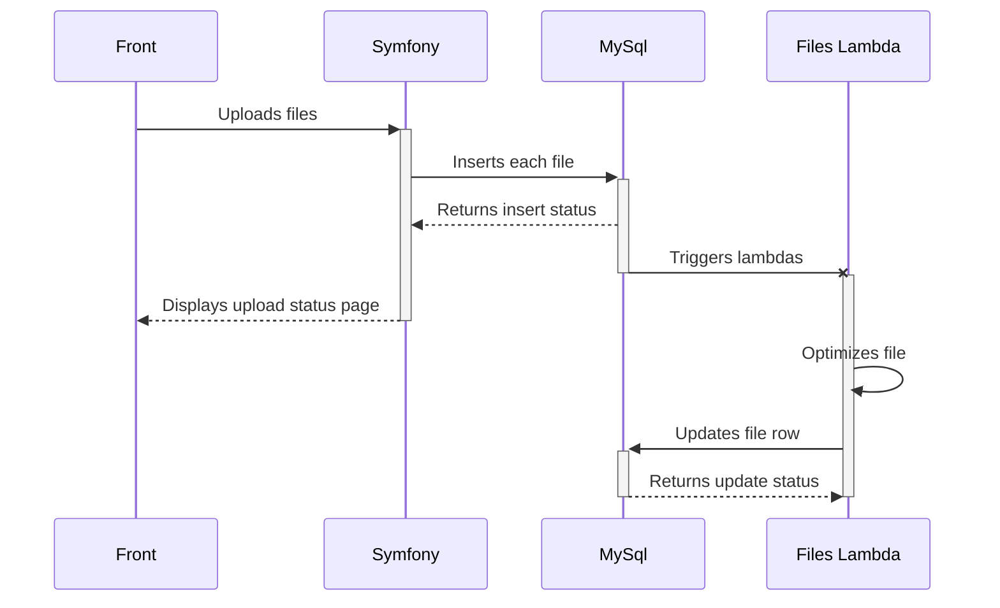
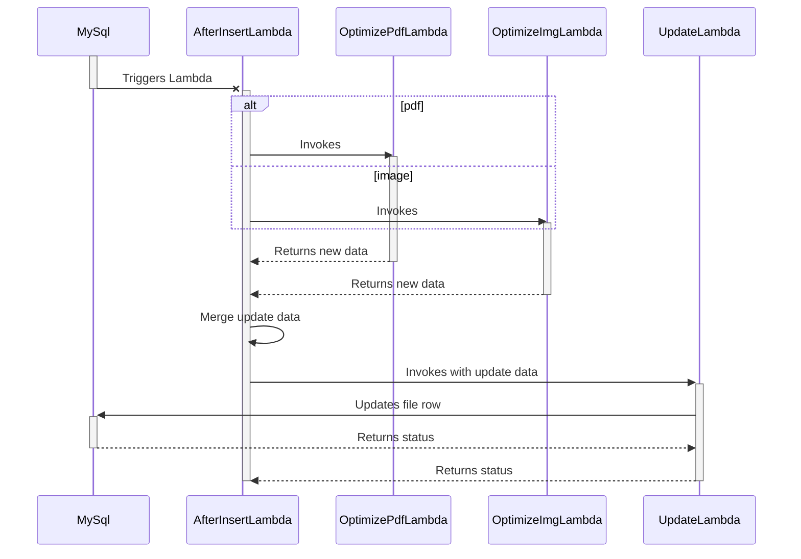
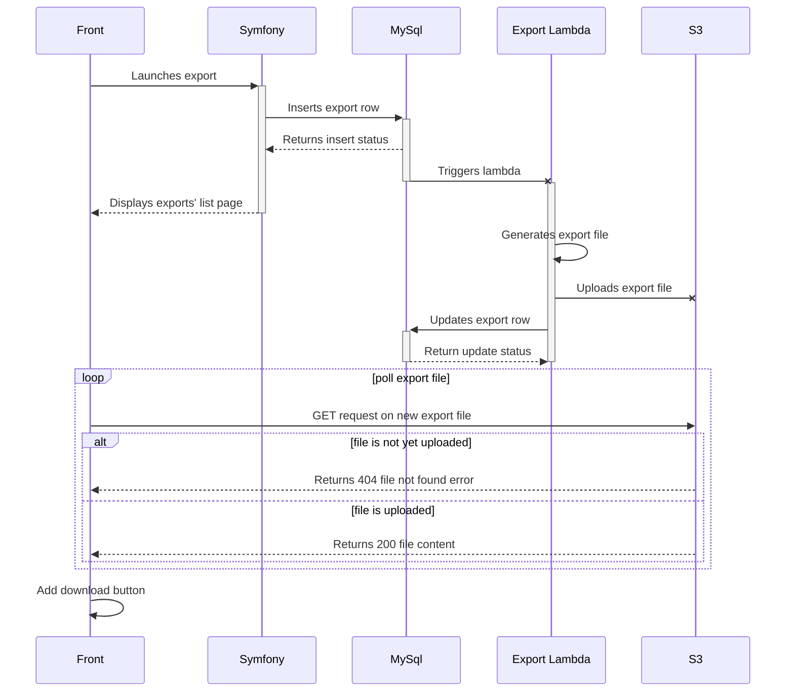
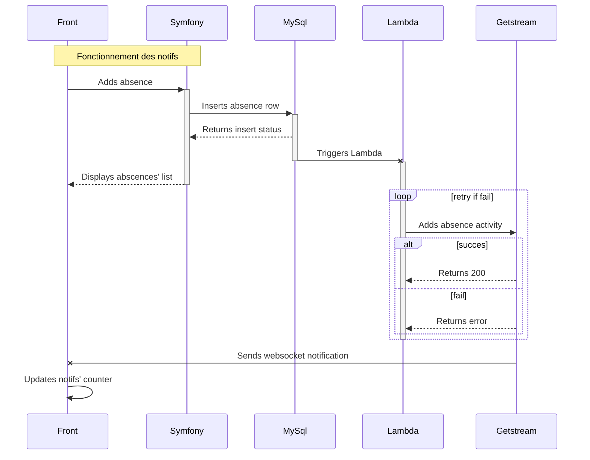
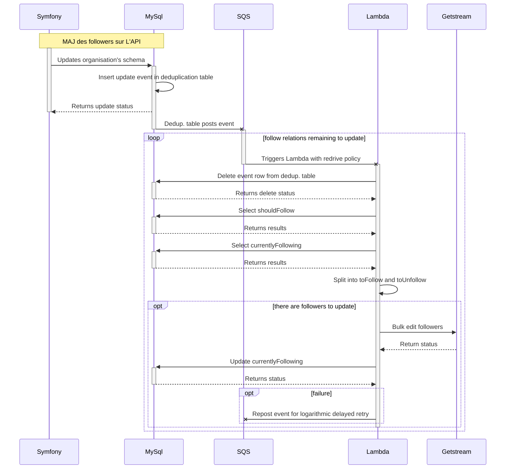
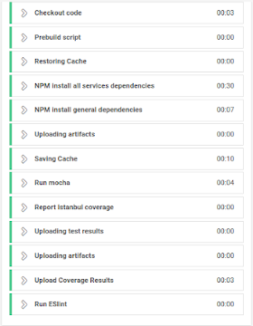
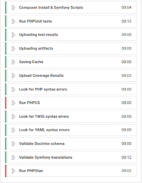
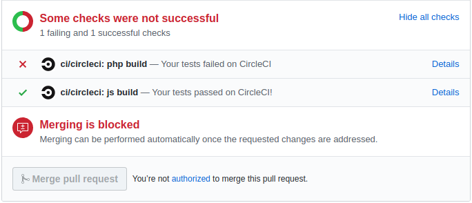

# Rapport de mission professionnelle

**Année**

2018-2019

**Étudiant**

Peugnet Nicolas

**Intitulé de la mission**

Développeur Web PHP (Symfony3), Javascript (Node.js sur serverless)

**Entreprise**

Manasoft  
42 rue Paul Claudel  
91000 Évry

**Responsable**

Hmiche Bilal

**Tuteur Académique**

Béréziat Dominique

## Sommaire

[TOC]

## 1. Résumé

Mon objectif principal au cours de cette mission professionnelle était d'approfondir mes connaissance en développement  web. J'ai choisi Manasoft premièrement en raison des langages de programmation utilisés: PHP[^php] et Javascript, les deux langages que j'avais le plus utilisés jusqu'alors. De cette manière j'étais sûr de ne pas être ralenti par les subtilités d'un nouveau langage, ce qui me permettrait de pouvoir me concentrer sur l'apprentissage de technologies plus poussées.

J'avais envie de me lancer dans la découverte en détail d'un framework web complet tel que Symfony[^symfony], car je n'avais jusqu'à maintenant qu’eu l'occasion d'utiliser des micro-frameworks PHP comme par exemple W[^w], découvert lors de mon dernier stage de BTS.

De la même manière, j'étais suffisamment à l'aise avec Javascript et Node.js pour être prêt à appréhender de nouvelles technologies telles que *serverless* et le reste des services d'AWS[^aws].

## 2. Présentation de l'entreprise

Manasoft est une entreprise d'une quinzaine de salariés. Elle produit des logiciels web de gestion à destination des entreprise. Il s'agit donc d'un modèle de type _B2B_[^b2b].

Parmi les deux équipes de développeurs existante, j'intégrais l'équipe de développement web. Celle-ci étant chargée de développer de nouvelles fonctionnalités aux applications. L'autre équipe de développeurs s'occupe quand à elle des fonctionnalités basées sur le *machine-learning*[^ml], comme par exemple l'OCR[^ocr] pour l'ajout automatique d'une note de frais à partir d'une image ou encore la détection d'un arrêt d'utilisation de l'application par un client.

Trois logiciels sont actuellement développés:

-   **Manatime** - logiciel de gestion RH[^rh] (congés payés, absences, time-tracking, etc...)
-   **Manacost** - logiciel de gestion des notes de frais
-   **Manacount** - logiciel à destination des comptables

Ces trois applications sont toutefois vouées à être fusionnées en une application unique composée de modules indépendants. Elle sont actuellement principalement développées en PHP[^php] et basées sur le framework web Symfony3[^symfony] et utilisent toutes trois la même base de données MySql[^mysql]. Il s'agit donc d'applications *monolithiques*, c'est-à-dire composées d'un seul bloc de code comprenant l'ensemble des fonctionnalités de chaque application, ce bloc de code étant lancé sur un serveur unique. Contrairement à une architecture dite de *micro-service*, une architecture *monolithique* est difficile à *scaler*[^scaling]. Il existe en effet deux manières de *scaler* une application :

1.  **Verticalement** - ce qui consiste à augmenter **la puissance du serveur** faisant tourner l'application. Avec plus de puissance, plus d'opérations sont possibles dans un même laps de temps, ce qui permet effectivement d'augmenter le nombre de requêtes traitées. Ce mode de mise à l'échelle souffre néanmoins d'un inconvénient majeur : il est impossible de modifier la puissance d'une machine sans la redémarrer, ce qui ne permet par conséquent pas de gérer un pic de requêtes important.
2.  **Horizontalement** - ce qui consiste à augmenter **le nombre de serveurs** faisant tourner l'application, permettant ainsi de traiter en parallèle plusieurs requêtes et donc d'en traiter plus dans un même laps de temps. Contrairement au *scaling* vertical, il est possible de lancer instantanément (à l'aide des nouvelles technologies cloud) de nouveau serveurs pour s'adapter en direct à un pic de requêtes. Il est également possible d'arrêter des serveurs lorsque ceux-ci ne sont plus nécessaire. Le *scaling* horizontal est donc plus flexible car il permet d'adapter la puissance au plus près de la demande et ainsi de réduire les coûts d'hébergement en "ne payant que ce dont on a besoin".

Vous l'aurez donc compris, Manasoft cherche à rendre ses applications plus *scalables* et s'oriente donc vers un *scaling* de type horizontal. Pour cela le fournisseur de services cloud IAAS[^iaas] **AWS**[^aws] a été choisi, notamment pour son service *serverless* **AWS Lambda** très efficace.

*Serverless* est un paradigme de programmation dans lequel **chaque fonction** de l'application est lancée dans une micro-machine-virtuelle dédiée. Ces machines-virtuelles peuvent être démarrées en plusieurs exemplaires et arrêtées à la volée en quelques secondes, permettant ainsi un *scaling* horizontal indépendant pour **chaque fonction** de l'application.

## 3. Travail effectué

### 3.1. Prise en main

La première chose que j'ai eu à faire en arrivant à Manasoft a évidemment été de me familiariser avec l'environnement de développement. En effet celui-ci est assez complexe et comprenait un certain nombre de nouveautés pour moi. J'ai donc commencé par l'installation de l'environnement sur ma machine personnelle, la lecture de documentations et la réalisation de tâches simples pour prendre en main le projet.

#### 3.1.1. Nouvelles technologies (pour moi)

Parmi les technologies utilisées par l'entreprise, certaines m'étaient inconnues. Il s'agit en particulier de l'ensemble des services de développement cloud d'AWS[^aws]. Et, bien que maîtrisant globalement bien le langage PHP et le principe des frameworks MVC[^mvc], je n'avais que peu d'expérience sur le framework web principalement utilisé dans l'entreprise (Symphony3[^symfony]). J'ai donc également dû m'y former.

#### 3.1.2. Lambda admin simples

Pour commencer en douceur, des tâches simples et sans trop de responsabilités m'ont, dans un premier temps, été attribuées. En effet, le logiciel étant déployé en production et déjà utilisé par plusieurs milliers de clients quotidiennement, directement modifier les fonctionnalités de l'application en tant que première mission peut s'avérer risqué. Par conséquent j'ai commencé par ajouter et modifier des fonctionnalités du logiciel de gestion de l'application, utilisé en interne par les commerciaux de l'entreprise. Cela avait pour avantage de ne pas impacter l'expérience utilisateur des clients.

Ainsi ma toute première mission de développement fût de réaliser une fonction *AWS[^aws] Lambda* permettant de rechercher des utilisateurs dans la base de données. Celle-ci a immédiatement été suivie par une seconde *Lambda*, cette fois de modification des données d'une entreprise.

#### 3.1.3. Architecture du traitement des fichiers

Une fois ces deux premières *Lambda* d'initiation terminées je passe à la modification de l'architecture du système de traitement de fichiers. Cette partie du code étant utilisée par l'application en production, elle est donc plus sensible, j'entre ainsi dans le cœur du sujet. Ce système est également géré par des *Lambda* car il s'agit d'un traitement lourd qu'il est préférable de gérer de manière asynchrone.

Le système a été modifié afin de retirer un maximum de logique du trigger[^trigger] MySql[^mysql]. En effet, si un bug se manifeste dans ce trigger[^trigger], l'ensemble du *cluster*[^cluster] d'écriture se retrouve en péril. De plus, le nombre de connexions parallèles en écriture à la base de données étant limité, il était devenu impératif de n'utiliser qu'une seule *Lambda* pour mettre à jour la base de données en une seule connexion et avec une requête unique. En effet le système de traitement des fichiers est composé de six *Lambda* effectuant chacune un traitement sur un fichier. Jusqu'alors chaque *Lambda* mettait à jour la base de données avec ses propres informations, ceci multipliant par six le nombre de connexions parallèles et le nombre de requêtes.

Pour résoudre ces deux problèmes, une lambda a été ajoutée pour s'interfacer entre le trigger[^trigger] de la base de données et l'ensemble des *Lambda* d’optimisation. Donnant ainsi l'architecture suivante (en omettant certaines *Lambda* d'optimisation) :

### 3.2. Proposition d'intégration d'une bibliothèque logicielle

Lors de la réalisation de ces *Lambda*, j'ai remarqué qu'un certain temps était perdu, lors du développement, à fabriquer des requêtes SQL[^sql] à la main en concaténant des chaînes de caractères. En effet, les données manipulées en OOP[^oop], comme c'est le cas avec les deux langages utilisés à Manasoft (Javascript & PHP) se présentent sous la forme d'objets. Ceux-ci peuvent contenir d'autres objets et ce sur plusieurs niveaux. On a donc une représentation des données en arborescence. Or dans une base de données relationnelle telle que MySql[^mysql], les données ne sont pas stockées sous la forme d'objets mais sous la forme de tables, reliées entre elles les unes aux autres. Cela implique de faire des jointures entre plusieurs tables pour récupérer le contenu complet d'un objet.

En PHP, pour simplifier la transition entre ces deux modes de représentation des données, un ORM[^orm] intégré au framework : Doctrine[^doctrine], est utilisé comme couche d'abstraction. Celui-ci nous permet de ne pas nous soucier de la complexité des requêtes SQL, et ainsi d'augmenter sensiblement la rapidité de développement d'une nouvelle fonctionnalité.

Dans le cas des *Lambda*, chacune d'entre elle est indépendante des autres, ce qui ne nous permet pas de mettre en commun un schéma de mappage objet-relations. Les requêtes SQL et la transformation des données brutes en objets doivent donc être réalisés à la main. Afin de ne plus avoir à faire autant d'opérations manuelles j'ai proposé l'introduction d'une bibliothèque logicielle : un _query builder_.

Les autres membres de l'équipe web m'ont alors encouragé à rechercher et tester l'ensemble des solutions existantes. J'ai donc réalisé une courte présentation comparant les différentes solutions qui me sont apparues pertinentes. Et c'est après discussion avec le reste de l'équipe que l'une de ces solution a été retenue: Knex.js[^knex].

### 3.3. Exports

 une Ma tâche suivante a été de réaliser un système asynchrone d'export de données au format CSV[^csv] et permettant également de sauvegarder l'historique des exports réalisés. De cette manière il est possible pour l'utilisateur de télécharger à nouveau un export réalisé par le passé. Ce système devait également permettre de sélectionner des filtres poussés lors de l'export.

#### 3.3.1. Réflexions

Après de multiples réflexions, schémas et discussions, le principe _d'event-driven programming_ a été retenu pour réaliser cette fonctionnalité. Ce principe consiste à considérer l'insertion d'une ligne dans une table de la base de donnée comme un événement et de déclencher un traitement à partir de cet événement. 

Nous avons également choisi de réaliser le traitement de manière asynchrone[^async] par une *Lambda*. Le système de fichier d'amazon S3 sera utilisé à la fois pour le stockage des fichiers et comme cible pour le polling[^polling] exécuté par le front[^front].

#### 3.3.2. Principe et implémentation

Cette fonctionnalité n'a, dans un premier temps, été réalisée que pour l'export des utilisateurs. Pour la réaliser, deux tables ont été ajoutés au schéma de données: `export_user` et `generic_file_generated`. La table `export_user` contenant les informations d'exports tels que les filtres et la date de création. La table `generic_file_generated` contenant quand à elle les informations propres au fichier généré comme par exemple son URL[^url] ou encore sont poids.

Comme on peut le voir dans le schéma précédent, le principe d'_event-driven programming_ permet bien de réduire la charge de l'application Symfony, ce qui améliore le temps de réponse global de l'application pour afficher les pages.

Une fois ce système réalisé pour l'export d'utilisateurs, il a été rendu générique afin de pouvoir fonctionner pour d'autres exports. Les exports de trackings et de notes de frais ont ainsi été réalisés relativement rapidement.

### 3.4. Notifications en temps réel

L'application étant codée en PHP et n'utilisant pas de framework front, il est compliqué d'y ajouter des fonctionnalités dynamiques. Pour des notifications en temps réel, il paraissait évident de tirer parti de l'efficacité des *WebSockets*[^ws] dans ce domaine. AWS[^aws] ayant récemment ajouté cette fonctionnalité à son *API*[^api] *Gateway* et fourni un exemple d'implémentation de cette fonctionnalité via des *Lambda*. Nous avions donc deux possibilités :

1.  Implémenter cette fonctionnalité en interne à l'aides outils d'AWS. Cela représentait tout de même une grosse charge de travail ainsi que l'utilisation de technologies nouvelles pour l'entreprise telles que *DynamoDB* ou *Redis*.
2.  Utiliser un service PAAS[^paas] externe 

#### 3.4.1. Recherche d'une solution technique

Après avoir décider de ne pas recréer un système complet à partir des outils d'AWS à cause d'une charge de travail trop élevée, il restait encore à choisir quel service externe mettre en place. J'ai réalisé un tableau comparatif de deux outils externe permettant d'implémenter ce système : Getstream[^getstream] et Pusher[^pusher].

#### 3.4.2. Implémentation

La méthode retenue a donc été celle basée sur Getstream[^getstream], un service cloud PAAS[^paas] permettant à la fois de gérer les redirection pub/sub[^pubsub] des différents flux (appelés *stream*) vers leurs subscribers (appelés *followers*), le stockage des notifications (appelées _activity_), la gestion des notifications vue/lues et l'envoi de notifications au front[^front] via les WebSockets[^ws].

Le schéma précédent montre le fonctionnement de la création d'une notification lors de l'ajout d'une absence. Cependant pour que celui-ci fonctionne correctement il faut que les *subscribers* aient été définis afin qu'ils puissent recevoir une notification. Afin de ne pas avoir à créer une infinité de triggers[^trigger] mettant chacun à jour les _followers_ sur Getstream j'ai imaginé un système d'événement unique permettant de simplifier énormément le code de la mise à jour de *followers*. Une *Lambda* se charge de traiter cet événement en recherchant les relation qui devrait exister (`shouldFollow`) puis en les comparant avec celle existantes actuellement (`currentlyFollowing`) pour obtenir la liste des relation à ajouter (`toFollow`) et celle des relations à supprimer (`toUnfollow`). Afin de ne pas déclencher la *Lambda* d'update en parallèle pour un même événement lors d'une édition de masse, une table MySql[^mysql] de dé-duplication a été créée. Un trigger sur l'insertion dans la table de dé-duplication déclenche ensuite la séquence de mise à jour des _followers_ sur Getstream.

Ce schéma a été simplifiée car à cause du VPC[^vpc] mis en place par Manasoft, plusieurs autres *Lambda* ont été nécessaire au bon fonctionnement du pipeline.

### 3.5. Intégration continue et qualité de code

Pour simplifier les *reviews* des *pull requests*[^pr] j'ai du mettre en place une intégration continue faisant des tests automatisés.

 

### 3.6. Découpage en Micro-services Symfony[^symfony]

Afin de diminuer la complexité du projet global, il a été décidé de fusionner les trois applications en une tout en les découpant en modules, les plus indépendants possible les uns des autres. De cette manière il est plus simple pour une personne de ne s'occuper que du développement d'un module, car le code correspondant n'est pas noyé dans le reste du code de l'application.

Pour préparer cette transition importante, deux choses étaient absolument nécessaires à mettre en place :

1.  Un logiciel de gestion d'erreur permettant d'attribuer les erreurs aux développeurs concernés.
2.  Une base de code partagée qui servirait de SDK[^sdk].

#### 3.6.1. Recherche d'un logiciel de gestion d'erreurs

L'ancien système de gestion étant basé sur un envoi de mail groupé, un système d'attribution des erreurs devait être mis en place afin que les développeurs ne soit pas submergés par les erreurs affluent de chaque module.

#### 3.6.2. Le core-bundle

## 4. Conclusion

## 5. Références

**Notes**

[^b2b]: B2B : Business to Business.
[^ml]: Machine learning : "apprentissage machine", forme d'intelligence artificielle basée sur le croisement d'un très grand nombre de données afin d'obtenir un résultat en les regroupant par catégories.
[^ocr]: OCR : Optical Character Recognition.
[^rh]: RH : Ressources Humaines.
[^php]: PHP: Language de programmation web.
[^iaas]: IAAS : Infrastructure As A Service.
[^mysql]: MySql : Système de gestion de base de données relationnelles.
[^scaling]: Scaling : "mettre à l'échelle", soit, adapter la puissance de l'application au nombre de requêtes qu'elle reçoit.
[^aws]: AWS : Amazon Web Services.
[^mvc]: MVC : Model View Controller, l'un des design pattern les plus classiques pour un framework web.
[^trigger]: Trigger : "déclencheur", permettant de lancer une action.
[^cluster]: Cluster : grappe de serveurs sur un réseau.
[^sql]: SQL : Structured Query Language, langage permettant de faire des requêtes sur une base de données.
[^oop]: OOP : Object Oriented Programming, "Programmation Orientée Objet".
[^orm]: ORM : Object Relationnal Mapping.
[^csv]: CSV : Coma Separated Values.
[^async]: Asynchrone : Appel d'une fonction sans attendre son retour pour continuer l'execution.
[^ws]: WebSockets : Protocole web de communication asynchrone en full duplex.
[^api]: API : Application Programming Interface.
[^paas]: PAAS : Platform As A Service.
[^polling]: Polling : Fait de réaliser plusieurs requêtes à la suite à un serveur pour lui demander des nouveautés.
[^front]: Front : Front-end, portion du code d'une application web affiché ou exécuté par le navigateur du client.
[^url]: URL : Uniform Resource Locator, plus simplement un lien hypertexte.
[^pubsub]: pub/sub : Publisher / Subscriber, mécanicisme de distribution de messages d'un publisher vers plusieurs subscribers.
[^vpc]: VPC: Virtual Private Cloud, système de pare-feu du cloud d'AWS.
[^symfony]: Symfony : https://symfony.com/
[^doctrine]: Doctrine : https://www.doctrine-project.org/
[^knex]: Knex.js : http://knexjs.org/
[^getstream]: Getstream : https://getstream.io/
[^pusher]: Pusher : https://pusher.com/
[^w]: W : https://github.com/axessweb/W
[^sdk]: SDK : Software Development Kit, un ensemble d'outils logiciels facilitant le développement d'un logiciel sur une plateforme donnée.
[^pr]: Pull request : Mécanisme permettant de proposer une modification de code source, celle-ci sera la plupart du temps *reviewée* par au moins une personne avant d'être intégrée.