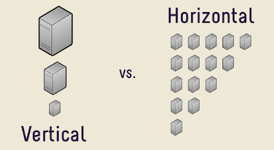
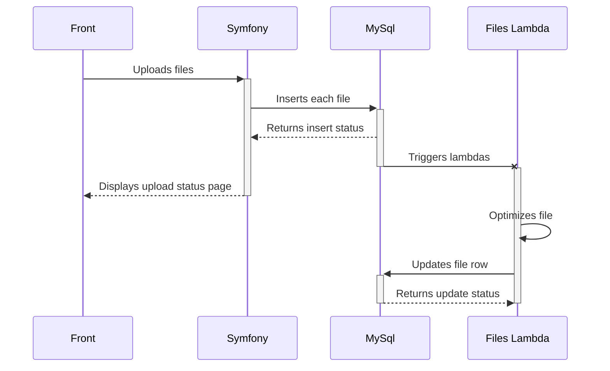
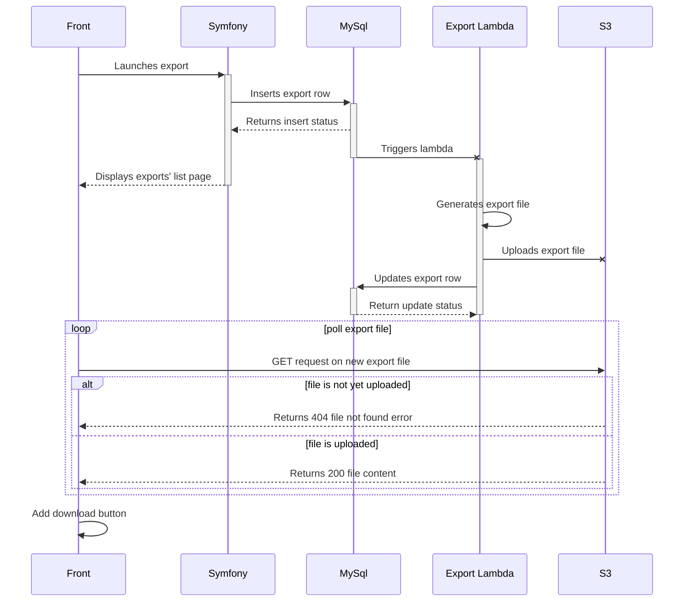
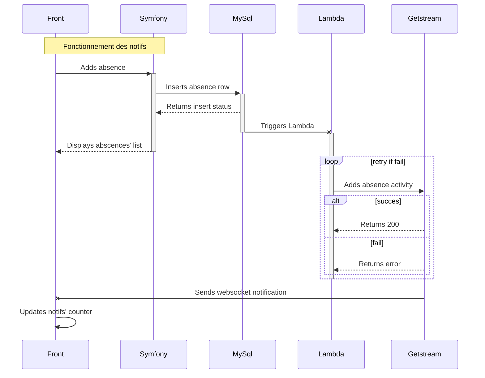
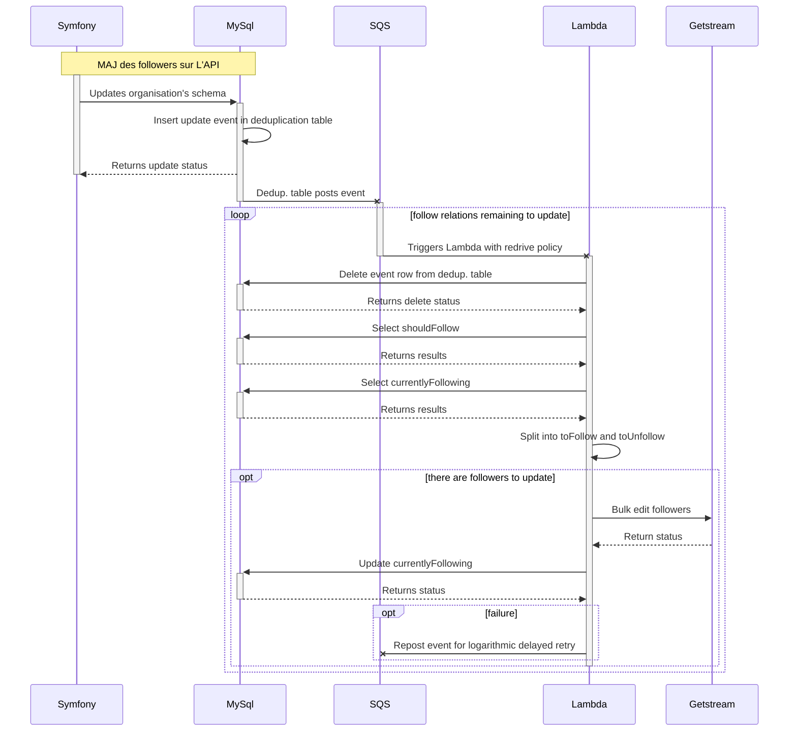

# Rapport de mission professionnelle

**Année**

2018-2019

**Étudiant**

Peugnet Nicolas

**Intitulé de la mission**

Développeur Web PHP (Symfony3), Javascript (Node.js sur serverless)

**Entreprise**

Manasoft  
42 rue Paul Claudel  
91000 Évry

**Responsable**

Hmiche Bilal

**Tuteur Académique**

Béréziat Dominique

## Sommaire

[TOC]

## 1. Résumé

## 2. Présentation de l'entreprise

Manasoft est une entreprise d'une quinzaine de salariés. Elle produit des logiciels web de gestion à destination des entreprise. Il s'agit donc d'un modèle de type _B-to-B_.

Parmi les deux équipes de développeurs existante, j'intégrais l'équipe de développement web. Celle-ci étant chargée de développer de nouvelles fonctionnalités aux applications. L'autre équipe de développeurs s'occupe quand à elle des fonctionnalités basées sur le *machine-learning* ("apprentissage machine", forme d'intelligence artificielle basée sur le croisement d'un très grand nombre de données afin d'obtenir un résultat en les regroupant par catégories), comme par exemple l'OCR (Optical Character Recognition) pour l'ajout automatique d'une note de frais à partir d'une image ou encore la détection d'un arrêt d'utilisation de l'application par un client.

Trois logiciels sont actuellement développés:

-   **Manatime** - logiciel de gestion RH (congés payés, absences, time-tracking, etc...)
-   **Manacost** - logiciel de gestion des notes de frais
-   **Manacount** - logiciel à destination des comptables

Ces trois applications sont toutefois vouées à être fusionnées en une application unique composée de modules indépendants. Elle sont actuellement principalement développées en PHP et basées sur le framework web Symfony3 et utilisent toutes trois la même base de données MySql. Il s'agit donc d'applications *monolithiques*, c'est-à-dire composées d'un seul bloc de code comprenant l'ensemble des fonctionnalités de chaque application, ce bloc de code étant lancé sur un serveur unique. Contrairement à une architecture dite de *micro-service*, une architecture *monolithique* est difficile à *scaler* ("mettre à l'échelle", soit, adapter la puissance de l'application au nombre de requêtes qu'elle reçoit). Il existe en effet deux manières de *scaler* une application :

1.  **Verticalement** - ce qui consiste à augmenter **la puissance du serveur** faisant tourner l'application. Avec plus de puissance, plus d'opérations sont possibles dans un même laps de temps, ce qui permet effectivement d'augmenter le nombre de requêtes traitées. Ce mode de mise à l'échelle souffre néanmoins d'un inconvénient majeur : il est impossible de modifier la puissance d'une machine sans la redémarrer, ce qui ne permet par conséquent pas de gérer un pic de requêtes important.
2.  **Horizontalement** - ce qui consiste à augmenter **le nombre de serveurs** faisant tourner l'application, permettant ainsi de traiter en parallèle plusieurs requêtes et donc d'en traiter plus dans un même laps de temps. Contrairement au *scaling* vertical, il est possible de lancer instantanément (à l'aide des nouvelles technologies cloud) de nouveau serveurs pour s'adapter en direct à un pic de requêtes. Il est également possible d'arrêter des serveurs lorsque ceux-ci ne sont plus nécessaire. Le *scaling* horizontal est donc plus flexible car il permet d'adapter la puissance au plus près de la demande et ainsi de réduire les coûts d'hébergement en "ne payant que ce dont on a besoin".

Vous l'aurez donc compris, Manasoft cherche à rendre ses applications plus *scalables* et s'oriente donc vers un *scaling* de type horizontal. Pour cela le fournisseur de services cloud IAAS (Infrastructure As A Service) **AWS** (Amazon Web Services) a été choisi, notamment pour son service *serverless* **AWS Lambda** très efficace.

*Serverless* est un paradigme de programmation dans lequel **chaque fonction** de l'application est lancée dans une micro-machine-virtuelle dédiée. Ces machines-virtuelles peuvent être démarrées en plusieurs exemplaires et arrêtées à la volée en quelques secondes, permettant ainsi un *scaling* horizontal indépendant pour **chaque fonction** de l'application.

## 3. Travail effectué

#### Semaine 44 (29 octobre)

-   Dernières finitions de la fonction de modification d'entreprise
-   Création d'un nouveau système de traitement des fichiers importés

#### Semaine 45 (5 novembre)

-   Finitions du système de traitement des fichiers
-   Recherches et réflexions autour d'un système d'export optimisé
    basé sur le concept d'event-driven programming depuis la base de données. Ce nouveau système permettra aux utilisateurs de conserver un historique de leurs exports tout en optimisant la rapidité de réponse.
-   Premiers essais d'implémentation du système d'export

#### Semaine 48 (26 novembre)

-   Application du nouveau système d'export pour créer la page d'exports d'utilisateurs:
    -   mise en place de l'infrastructure d'export
    -   génération du fichier exporté
    -   premier affichage de la liste des exports
    -   ajout des premiers filtres d'exports

#### Semaine 49 (3 décembre)

-   Poursuite du développement de la fonctionnalité d'export des utilisateurs:
    -   amélioration de la liste des exports
    -   ajout d'animations et de fonctionnalités d'interactions avec l'utilisateur
    -   fonctionnement correct de l'ensemble de la fonctionnalité
    -   factorisation d'une partie du code pour permettre la génération d'autres types d'exports
    -   documentation de la fonctionnalité
-   Début du développement d'un autre export de données basé sur le même principe

#### Semaine 52 (24 décembre)

-   Export d'utilisateurs:
    -   amélioration du nombre et de la qualités des données exportées
    -   ajout de plus de filtres et optimisations des filtres précedents
    -   amélioration de l'ergonomie des pages d'exports

### 3.1. Prise en main

La première chose que j'ai eu à faire en arrivant à Manasoft a évidemment été de me familiariser avec l'environnement de développement. En effet celui-ci est assez complexe et comprenait un certain nombre de nouveautés pour moi. J'ai donc commencé par l'installation de l'environnement sur ma machine personnelle, la lecture de documentations et la réalisation de tâches simples pour prendre en main le projet.

#### 3.1.1. Nouvelles technologies (pour moi)

Parmi les technologies utilisées par l'entreprise, certaines m'étaient inconnues. Il s'agit en particulier de l'ensemble des services de développement cloud d'AWS. Et, bien que maîtrisant globalement bien le langage PHP et le principe des frameworks MVC, je n'avais que peu d'expérience sur le framework web principalement utilisé dans l'entreprise (Symphony 3). J'ai donc également dû m'y former.

#### 3.1.2. Lambda admin simples

Pour commencer en douceur, des tâches simples et sans trop de responsabilités m'ont, dans un premier temps, été attribuées. En effet, le logiciel étant déployé en production et déjà utilisé par plusieurs milliers de clients quotidiennement, directement modifier les fonctionnalités de l'application en tant que première mission peut s'avérer risqué. Par conséquent j'ai commencé par ajouter et modifier des fonctionnalités du logiciel de gestion de l'application, utilisé en interne par les commerciaux de l'entreprise. Cela avait pour avantage de ne pas impacter l'expérience utilisateur des clients.

Ainsi ma toute première mission de développement fût de réaliser une fonction *AWS Lambda* permettant de rechercher des utilisateurs dans la base de données. Celle-ci a immédiatement été suivie par une seconde lambda, cette fois de modification des données d'une entreprise.

#### 3.1.3. Architecture du traitement des fichiers

Une fois ces deux premières *Lambda* d'initiation terminées je passe à la modification de l'architecture du système de traitement de fichiers. Cette partie du code étant utilisée par l'application en production, elle est donc plus sensible, j'entre ainsi dans le cœur du sujet. Ce système est également géré par des *Lambda* car il s'agit d'un traitement lourd qu'il est préférable de gérer de manière asynchrone.

Le système a été modifié afin de retirer un maximum de logique du trigger MySql. En effet, si un bug se manifeste dans ce trigger, l'ensemble du *cluster* d'écriture se retrouve en péril. De plus, le nombre de connexions parallèles en écriture à la base de données étant limité, il était devenu impératif de n'utiliser qu'une seule *Lambda* pour mettre à jour la base de données en une seule connexion et avec une requête unique. En effet le système de traitement des fichiers est composé de six *Lambda* effectuant chacune un traitement sur un fichier. Jusqu'alors chaque *Lambda* mettait à jour la base de données avec ses propres informations, ceci multipliant par six le nombre de connexions parallèles et le nombre de requêtes.

Pour résoudre ces deux problèmes, une lambda a été ajoutée pour s'interfacer entre le trigger de la base de données et l'ensemble des *Lambda* d’optimisation.

### 3.2. Proposition d'intégration d'une bibliothèque logicielle

Lors de la réalisation de ces *Lambda*, j'ai remarqué qu'un certain temps était perdu, lors du développement, à fabriquer des requêtes SQL (Structured Query Language) à la main en concaténant des chaînes de caractères. En effet, les données manipulées en OOP (Object Oriented Programming), comme c'est le cas avec les deux languages utilisés à Manasoft (Javascipt & PHP) se présentent sous la forme d'objets. Ceux-ci peuvent contenir d'autres objets et ce sur plusieurs niveaux. On a donc une représentation des données en arborescence. Or dans une base de données relationnelle telle que MySql, les données ne sont pas stockées sous la forme d'objets mais sous la forme de tables, reliées entre elles les unes aux autres. Cela implique de faire des jointures entre plusieurs tables pour récupérer le contenu complet d'un objet.

En PHP, pour simplifier la transition entre ces deux modes de représentation des données, un ORM (Object Relationnal Mapping) intégré au framework : Doctrine, est utilisé comme couche d'abstraction. Celui-ci nous permet de ne pas nous soucier de la complexité des requêtes SQL, et ainsi d'augmenter sensiblement la rapidité de développement d'une nouvelle fonctionnalité.

Dans le cas des *Lambda*, chacune d'entre elle est indépendante des autres, ce qui ne nous permet pas de mettre en commun un schéma de mappage objet-relations. Les requêtes SQL et la transformation des données brutes en objets doivent donc être réalisés à la main. Afin de ne plus avoir à faire autant d'opérations manuelles j'ai proposé l'introduction d'une bibliothèque logicielle : un _query builder_.

Les autres membres de l'équipe web m'ont alors encouragé à rechercher et tester l'ensemble des solutions existantes. J'ai donc réalisé une courte présentation comparant les différentes solutions qui me sont apparues pertinentes. Et c'est après discussion avec le reste de l'équipe que l'une de ces solution a été retenue: Knex.js.

### 3.3. Exports

 une Ma tâche suivante a été de réaliser un système asynchrone d'export de données au format CSV (Coma Separated Values) et permettant également de sauvegarder l'historique des exports réalisés. De cette manière il est possible pour l'utilisateur de télécharger à nouveau un export réalisé par le passé. Ce système devait également permettre de sélectionner des filtres poussés lors de l'export.

#### 3.3.1. Réflexions

Après de multiples réflexions, schémas et discussions, le principe _d'event driven programming_ a été retenu pour réaliser cette fonctionnalité. Ce principe consiste à considérer l'insertion d'une ligne dans une table de la base de donnée comme un événement et de déclencher un traitement à partir de cet événement. 

Nous avons également choisi de réaliser le traitement de manière asynchrone par une lambda

#### 3.3.2. Principe et implémentation

#### 3.3.3. Users

#### 3.3.4. Trackings

#### 3.3.5. Expenses

### 3.4. Notifications en temps réel

L'application étant codée en PHP et n'utilisant pas de framework front, il est compliqué d'y ajouter des fonctionnalités dynamiques. Pour des notifications en temps réel, il paraissait évident de tirer parti de l'efficacité des *WebSockets* dans ce domaine. AWS ayant récemment ajouté cette fonctionnalité à son *API* (Application Programming Interface) *Gateway* avait fourni un exemple d'implémentation de cette fonctionnalité via des *Lambda*. Nous avions donc deux possibilités :

1.  Implémenter cette fonctionnalité en interne à l'aides outils d'AWS. Cela représentait tout de même une grosse charge de travail ainsi que l'utilisation de technologies nouvelles pour l'entreprise telles que *DynamoDB*.
2.  Utiliser un service PAAS (Platform As A Service) externe 

#### 3.4.1. Recherche d'une solution technique

Après avoir décider de ne pas recréer un système complet à partir des outils d'AWS à cause d'une charge de travail trop élevée, il restait encore à choisir quel service externe mettre en place. J'ai réalisé un tableau comparatif de 3 outils permettant d'implémenter ce système, chacun à un niveau applicatif différent.

#### 3.4.2. Implémentation

### 3.5. Recherche d'un logiciel de gestion d'erreurs

### 3.6. Découpage en Micro-services Symfony

## 4. Conclusion

## 5. Bibliographie
